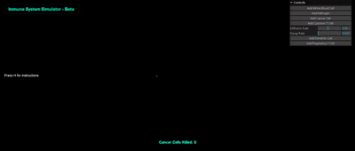

# ImmuneSystemSimulator
A core JavaScript HTML-served Three.js web page deployed to simulate a basic immune system. For educational purposes only.

  

A live working page of the simulation in action may be found [here](https://cheddarbutler.com/iss)
